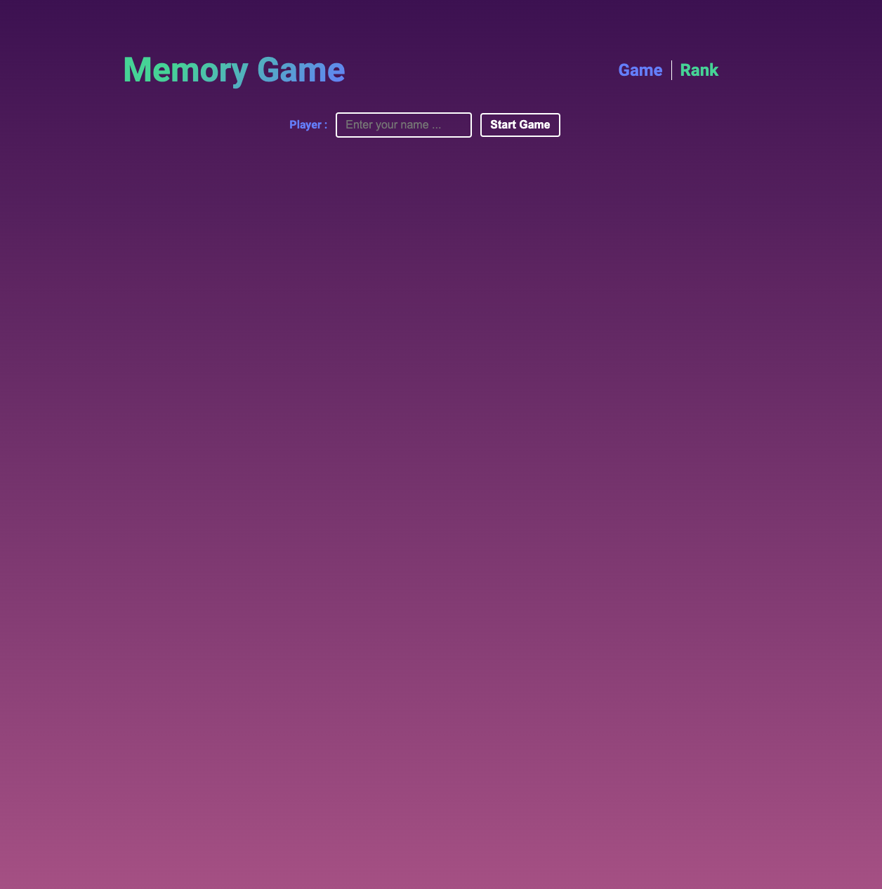
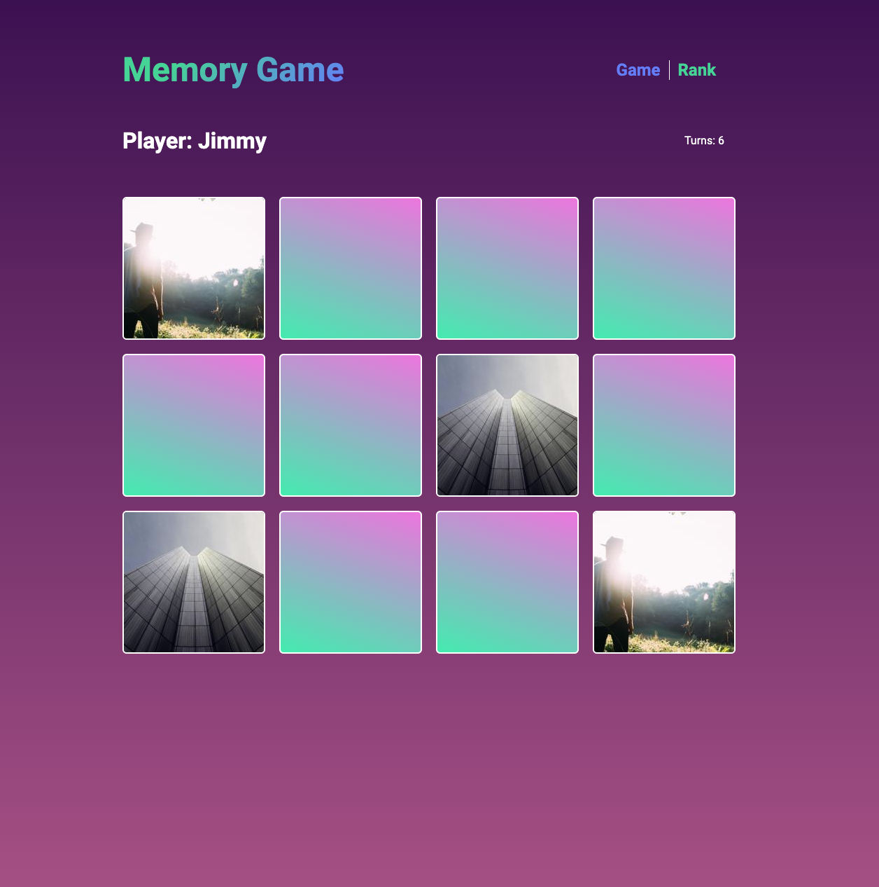
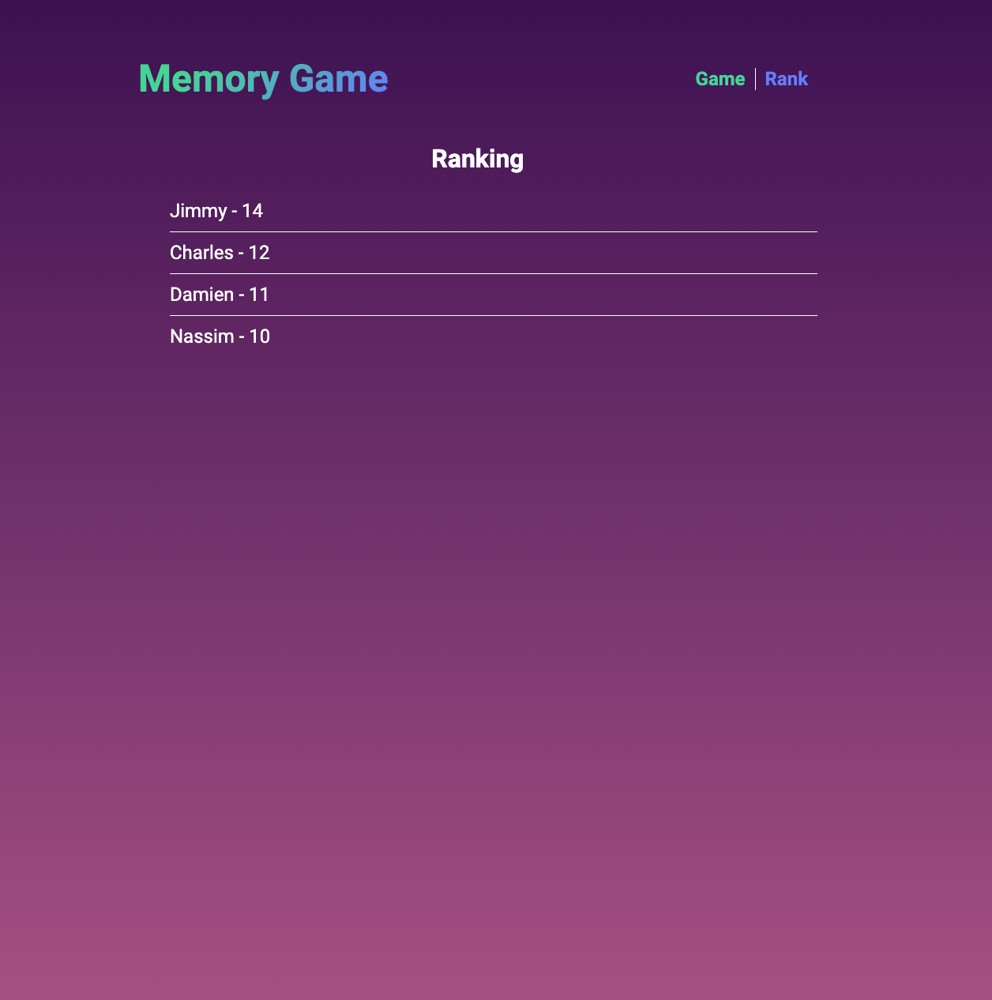

# Interview Memory Game Boilerplate

Hi and welcome in this Memory game challenge 👋

I hope you enjoy making this exciting game and have a good time on it 🎮.

Feel free to ask questions during this interview. We are here to discuss with you many technical aspects regarding VueJs 🧑‍💻.

## What you need to do
- Remove the homepage to redirect directly to the game page
- Build the memory game 
  - Create the game board
  - Display of player name, button to create a new game, number of turns
  - Save the result in store when we want to start a new game
- Display player name with rounds on rank page
- [BONUS] Persist the data of games played in order to allow the display of the results when the page reloads.

## Screenshots

<div align="center">
  
  
  
</div>


## Project setup

To make it easier for you to get started, we provide you with the following configuration.

Feel free to use it or add some dependencies if needed.


### Technical configuration

- ⚡️ [VueJs](https://vuejs.org/)
- 🛣 [Vue Router](https://router.vuejs.org/)
- 📦 [VueX Store](https://vuex.vuejs.org/)
- 👓 [Sass](https://sass-lang.com/)
- 🏎 [Eslint](https://eslint.org/)
- 🧙 [TypeScript](https://www.typescriptlang.org/)


### Install dependencies
```
npm install
```

### Compiles and hot-reloads for development
```
npm run serve
```

### Compiles and minifies for production
```
npm run build
```

### Lints and fixes files
```
npm run lint
```
